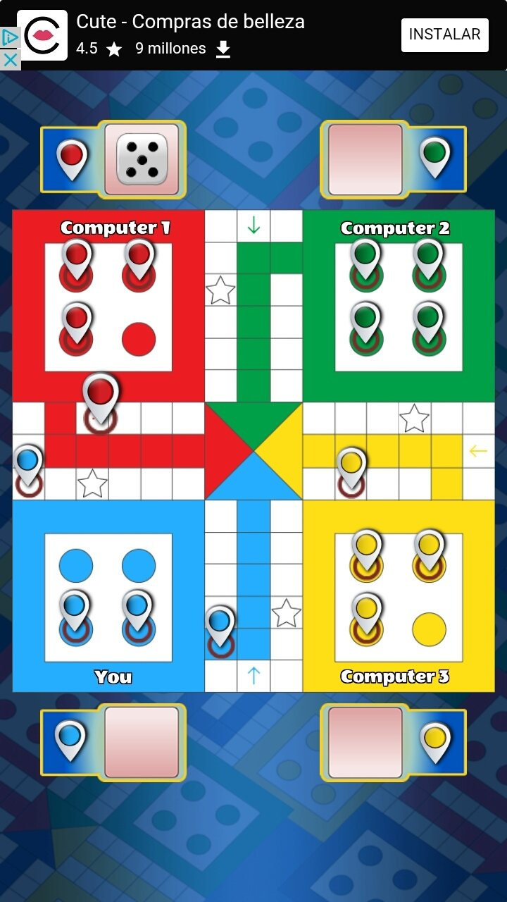

- after killing a player by stepping on it yo are supposed to get an additional turn
- the grid display should be slightly bigger and centered, instead of always clicking on roll button, every player should click on their own roll button to roll the dice so that players wouldn't have to all click on the same button , here is an image of a display example, remember that this game is supposed to be played on a phone 
- when a player gets 6 and the only choice is to take out one of their circles they shouldn't choose which one to get out since 